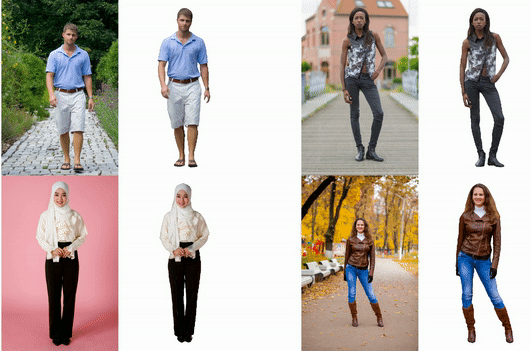
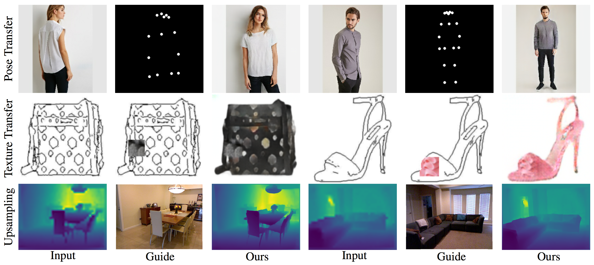

About me
======

I am an Assistant Professor in the Department of Computer Engineering at [Kuwait University](http://www.kuniv.edu.kw). My research interests are in the area of computer vision. I am particularly interested in controllable image synthesis. 

You can find my CV [here](../files/cv_november_2023.pdf).

Education
======

<table style="width:100%">
  <tr style="font-size:16px">
    <th style="text-align:right">
      August 2018 - May 2023
    </th>
    <th style="text-align:left">
      Ph.D. in Computer Engineering from Virgina Tech
    </th>
  </tr>
  
  <tr style="font-size:16px">
    <th style="text-align:right">
      August 2016 - May 2018
    </th>
    <th style="text-align:left">
      Master of Science in Computer Engineering from Virgina Tech
    </th>
  </tr>
  
  <tr style="font-size:16px">
    <th style="text-align:right">
      September 2010 - July 2014
    </th>
    <th style="text-align:left">
      Bachelor of Science in Computer Engineering from Kuwait University
    </th>
  </tr>
</table>

<!-- * **PhD Candidate** in Computer Engineering at **Virgina Tech** _(August 2018 - Present)_
* **Master of Science** in Computer Engineering from **Virgina Tech** _(August 2016 - May 2018)_
* **Bachelor of Science** in Computer Engineering from **Kuwait University** _(September 2010 - July 2014)_
 -->
 
Research
======

<table style="width:100%">
  <tr>
    <th>
      
    </th>
    <th style="text-align:left">
            Single-Image 3D Human Digitization with Shape-Guided Diffusion 
            Badour AlBahar, Shunsuke Saito, Hung-Yu Tseng, Changil Kim, Johannes Kopf, and Jia-Bin Huang 
            SIGGRAPH Asia 2023 
            <a href="https://human-sgd.github.io">project page</a> | <a href="https://arxiv.org/abs/2311.09221">paper</a> | <a href="">code (coming soon)</a>
    </th>
  </tr>

  
  <tr>
    <th>
      
    </th>
    <th style="text-align:left">
            Temporally Consistent Semantic Video Editing 
            Yiran Xu, Badour AlBahar, and Jia-Bin Huang 
            ECCV 2022 
            <a href="https://video-edit-gan.github.io/">project page</a> | <a href="https://arxiv.org/pdf/2206.10590.pdf">paper</a> | <a href="https://github.com/Twizwei/VideoEditGAN">code</a>
    </th>
  </tr>
  
   
  
  <tr>
    <th>
      
    </th>
    <th style="text-align:left">
            Pose with Style: Detail-Preserving Pose-Guided Image Synthesis with Conditional StyleGAN 
            Badour AlBahar, Jingwan Lu, Jimei Yang, Zhixin Shu, Eli Shechtman, and Jia-Bin Huang 
            ACM Transactions on Graphics (Proceedings of SIGGRAPH Asia), 2021 
            <a href="https://pose-with-style.github.io/">project page</a> | <a href="https://pose-with-style.github.io/asset/paper.pdf">paper</a> | <a href="https://github.com/BadourAlBahar/pose-with-style">code</a>
    </th>
  </tr>
  
   
  
  <tr>
    <th>
      
    </th>
    <th style="text-align:left">
            Guided Image-to-Image Translation with Bi-Directional Feature Transformation 
            Badour AlBahar and Jia-Bin Huang 
            ICCV 2019 
            <a href="https://guided-pix2pix.github.io/">project page</a> | <a href="https://arxiv.org/abs/1910.11328">paper</a> | <a href="https://github.com/vt-vl-lab/Guided-pix2pix">code</a> | <a href="https://guided-pix2pix.github.io/figures/guided_pix2pix_poster.pdf">poster</a>
    </th>
  </tr>
  
  
  
</table>

News
======

<table style="width:100%">
  <col style="width:20%">
  <col style="width:80%">
  
  <tr style="font-size:16px">
    <th style="text-align:right">
      Jan-May 2022
    </th>
    <th style="text-align:left">
      I joined Meta as a research intern working with <a href="http://www-scf.usc.edu/~saitos/">Shunsuke Saito</a>, <a href="https://hytseng0509.github.io/">Hung-Yu Tseng</a>, <a href="https://changilkim.com/">Changil Kim</a>, <a href="https://xrong.org/">Xuejian Rong</a>, <a href="https://www.linkedin.com/in/ayush29feb">Ayush Saraf</a>, <a href="http://johanneskopf.de/">Johannes Kopf</a>, and <a href="https://jbhuang0604.github.io/">Jia-Bin Huang</a>
    </th>
  </tr>
  
  <tr style="font-size:16px">
    <th style="text-align:right">
      Summer 2021
    </th>
    <th style="text-align:left">
      I joined Adobe Research as a research intern working with <a href="https://eng.ucmerced.edu/people/jyang44">Jimei Yang</a>, <a href="https://research.adobe.com/person/jingwan-lu/">Cynthia Lu</a>, <a href="https://people.umass.edu/~yangzhou/">Yang Zhou</a>, <a href="https://zhixinshu.github.io/">Zhixin Shu</a>, and <a href="https://research.adobe.com/person/eli-shechtman/">Eli Shechtman</a>
    </th>
  </tr>
  
  <tr style="font-size:16px">
    <th style="text-align:right">
      September 2019
    </th>
    <th style="text-align:left">
      Featured in <a href="https://dac.cs.vt.edu/2019/09/17/dac-student-spotlight-badour-albahar/">DAC Student Spotlight</a>
    </th>
  </tr>
  
  <tr style="font-size:16px">
    <th style="text-align:right">
      August 2016
    </th>
    <th style="text-align:left">
      Received a scholarship from Kuwait University to pursue my masters and Ph.D. at Virginia Tech
    </th>
  </tr>
</table>
